Dưới đây là **một file `README.md` hoàn chỉnh, chuyên nghiệp hơn và phù hợp để đưa lên GitHub portfolio của một Backend Developer (Python/Django)**. Bạn chỉ cần **copy toàn bộ và dán vào `README.md`**.

---

```markdown
# 👟 Shoe Store Website

## 📌 Introduction

**Shoe Store Website** is an e-commerce web application that allows users to browse, search, and purchase shoes online.

The system provides core e-commerce functionalities such as user authentication, product browsing, shopping cart management, and order checkout.

This project was developed to practice and demonstrate **Back-end development skills using Python and Django**.

---

# 🚀 Features

## 🔐 Authentication

- User registration
- User login / logout
- Edit user profile information

## 👟 Product Management

- View product list
- View product details
- Filter products based on different criteria

## 🛒 Shopping Cart

- Add products to cart
- View cart
- Update product quantity
- Remove products from cart

## 💳 Checkout

- View total order price
- Enter personal information
- Apply discount voucher
- Confirm order payment

## 📦 Order Management

- View order history
- Track purchased products

---

# 🛠️ Technologies Used

## Backend

- Python
- Django

## Frontend

- HTML
- CSS
- JavaScript

## Database

- SQLite

## Tools

- Git
- GitHub

---

# 📂 Project Structure

```

shoe-store
│
├── users
│ └── user authentication and profile management
│
├── products
│ └── product management and filtering
│
├── cart
│ └── shopping cart management
│
├── orders
│ └── order history management
│
└── vouchers
└── discount voucher system

```

---


# 🔄 Main User Flow

1. User registers or logs into the system
2. User browses available products
3. User filters products based on preferences
4. User adds products to the shopping cart
5. User reviews the cart
6. User proceeds to checkout
7. User can view order history

---


# ⚙️ Installation

## 1️⃣ Clone the repository

```

git clone [https://github.com/ThanhNhan2101/Django-Shoes-Shop](https://github.com/ThanhNhan2101/Django-Shoes-Shop)

```

## 2️⃣ Navigate to project folder

```

cd shoe-store

```

## 3️⃣ Create a virtual environment

```

python -m venv venv

```

## 4️⃣ Activate the virtual environment

Windows:

```

venv\Scripts\activate

```

Mac/Linux:

```

source venv/bin/activate

```

## 5️⃣ Install dependencies

```

pip install -r requirements.txt

```

## 6️⃣ Apply migrations

```

python manage.py makemigrations
python manage.py migrate

```

## 7️⃣ Run the development server

```

python manage.py runserver

```

Open in browser:

```

[http://127.0.0.1:8000/](http://127.0.0.1:8000/)

```

---

# 🧪 Default Admin Access (Optional)

If you want to create an admin account:

```

python manage.py createsuperuser

```

Then access:

```

[http://127.0.0.1:8000/admin](http://127.0.0.1:8000/admin)

```

---

# 📸 Screenshots


```

## Home Page
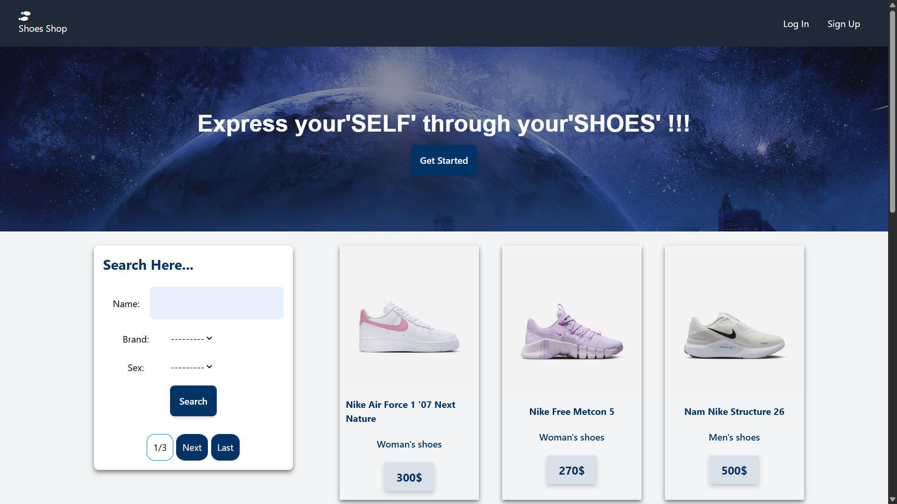
## Login Page
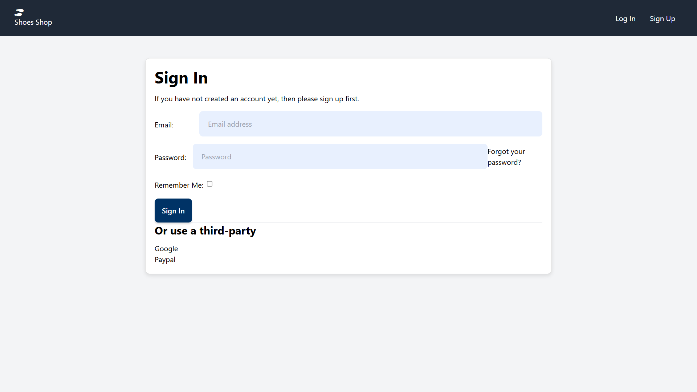
## Signup Page
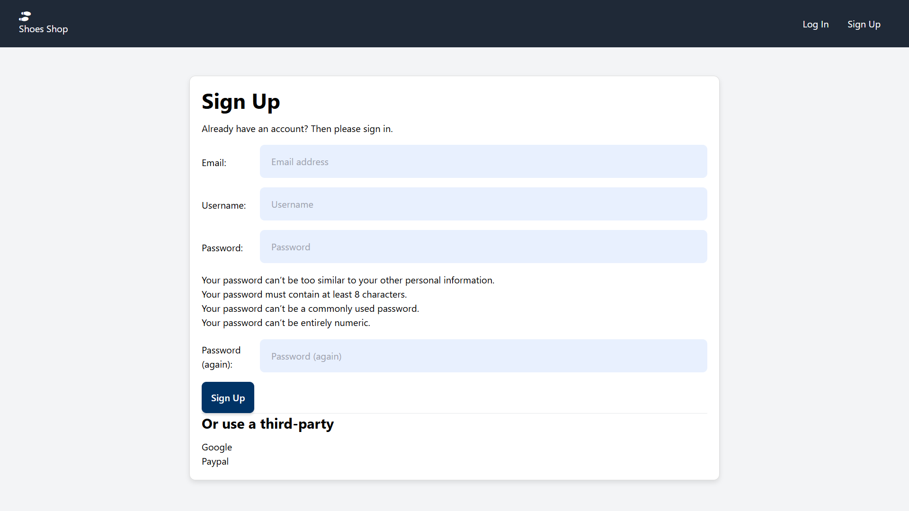
## Filter Page
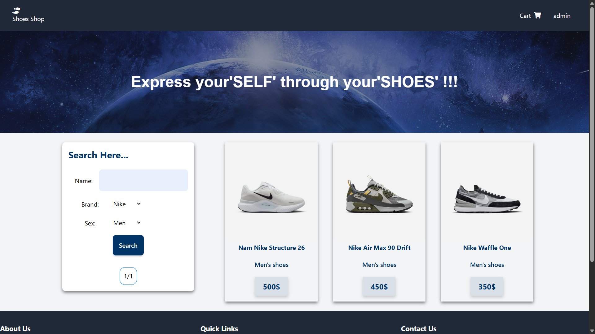
## Detail View
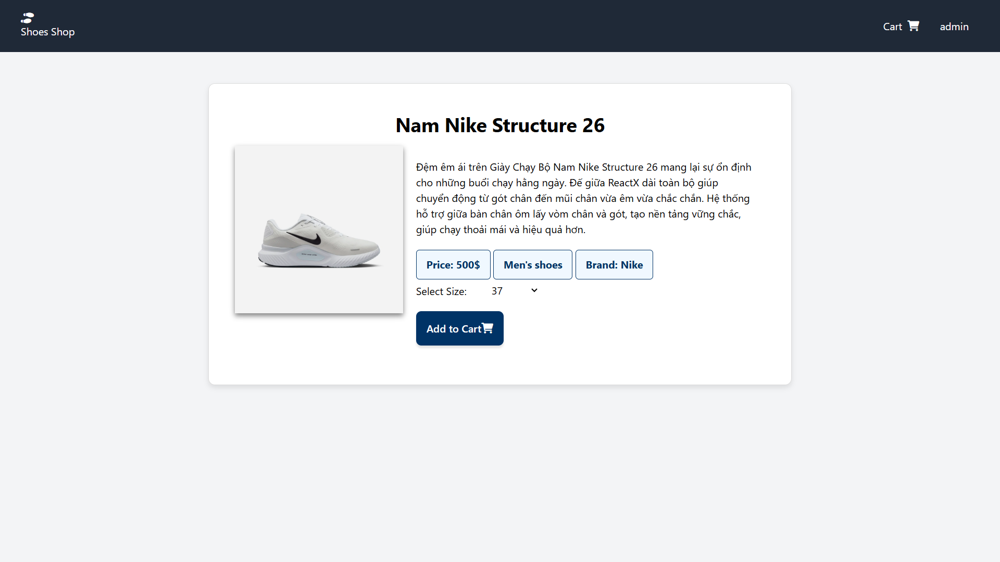
## Card View
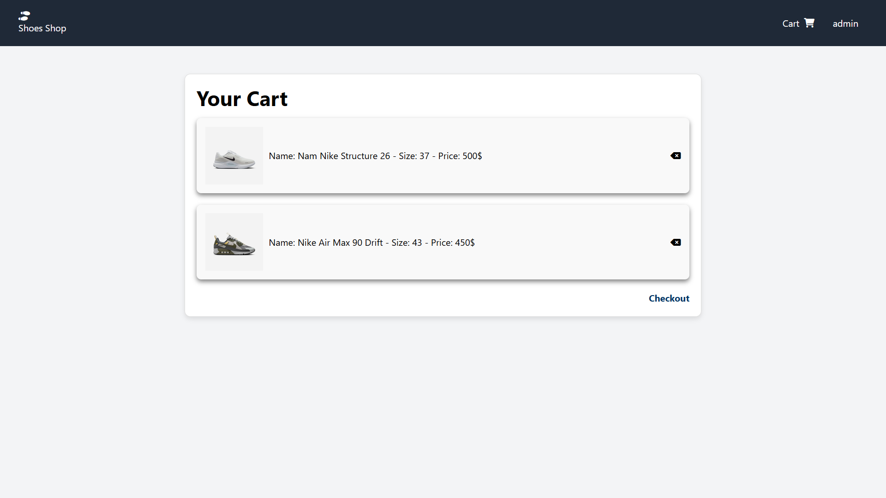
## Checkout View
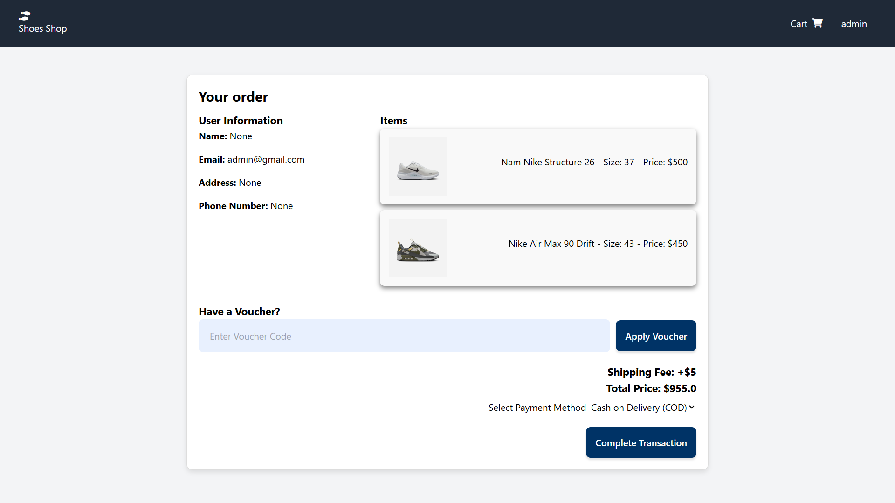
## Order history View
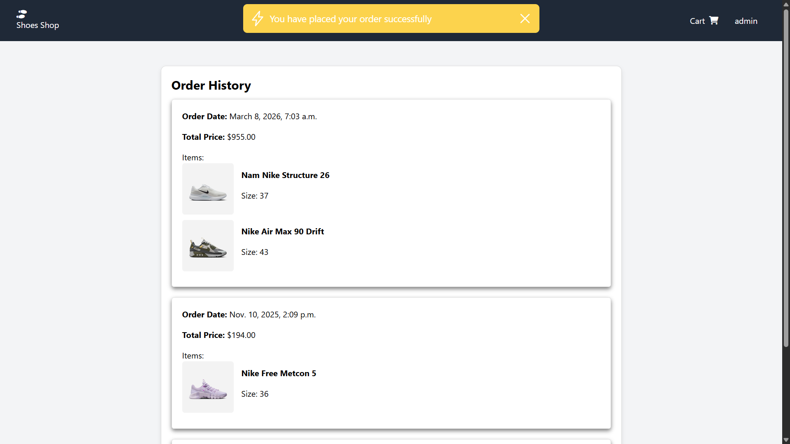
## User profile View
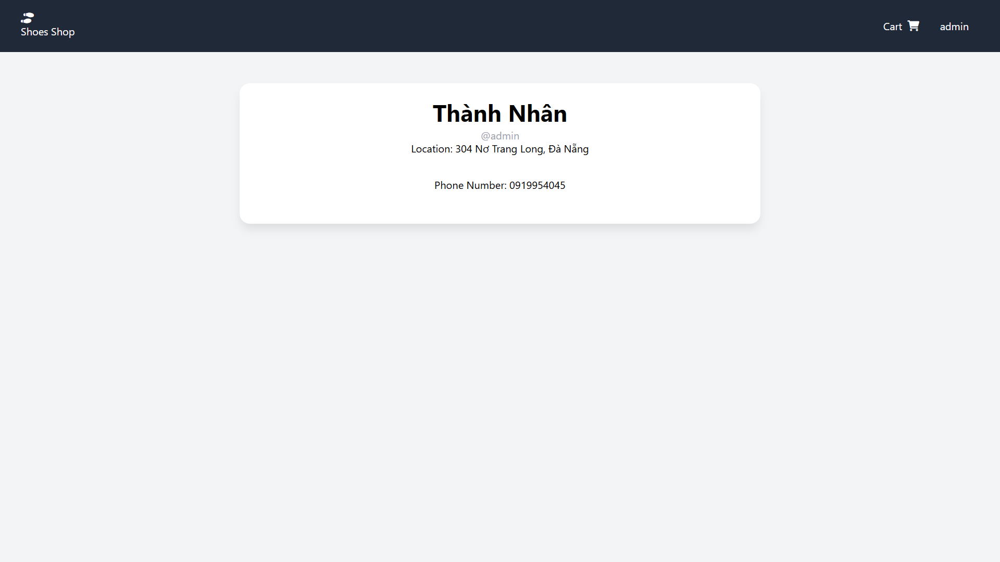
## Edit user profile View
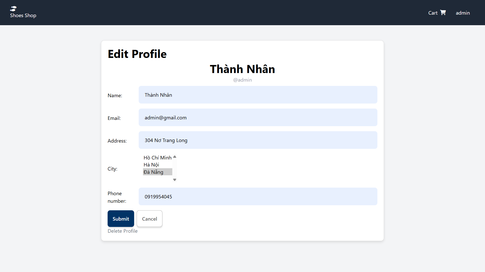
## Admin site View
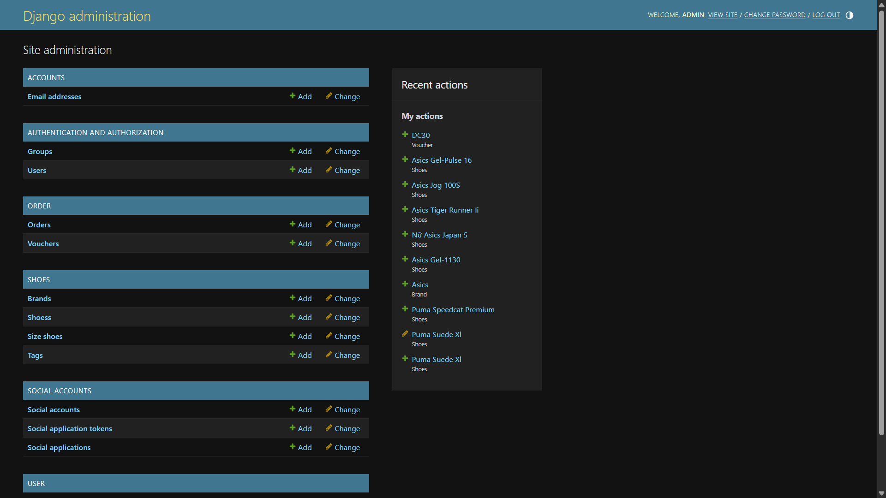

```

---

# 🔮 Future Improvements

- Online payment integration
- Product review and rating system
- Email notifications
- REST API integration
- Deploy to cloud (AWS / Docker)

---

# 👨‍💻 Author

**ThanhNhan**

Backend Developer (Python / Django)

